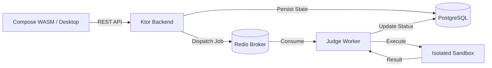
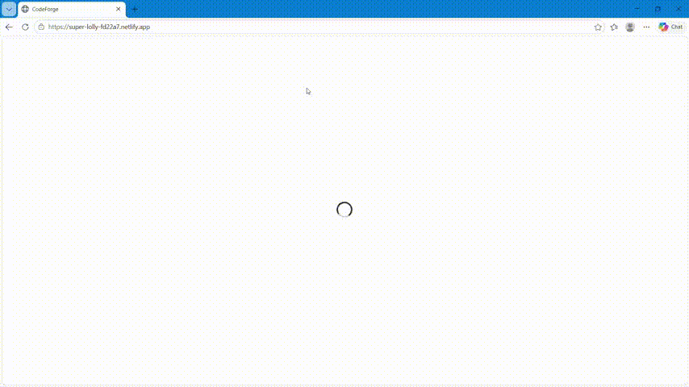

> ## 🔒 CodeForge Source Code
>
> **Public Portfolio • Private Implementation**
>
> 📚 This repository contains the **technical documentation, architecture, demos, and project overview** of CodeForge.
>
> 🔐 The **complete source code is private** to maintain implementation integrity.
>
> 👨‍💻 **Recruiters & Technical Evaluators:**  
> [**Request source code access →**](https://github.com/ItsDeadlyProgrammer/CodeForge)

# ⚡ CodeForge — Full-Stack Competitive Programming Platform

<h3 align="center">
Modern Online Judge • Docker Sandbox Execution • Kotlin Multiplatform
</h3>

  
  
  
  
  
  

---

## 🚀 What is CodeForge?

**CodeForge** is a production-grade competitive programming platform built from the ground up using a modern distributed architecture. Designed as a "LeetCode meets Codeforces" ecosystem, it enables real-time code execution in isolated environments, asynchronous job management, and multi-platform accessibility.

Unlike standard tutorial projects, CodeForge implements a complete judging pipeline:
- 🎯 **Isolated Execution:** Solutions run in secured Docker-based sandboxes.
- 📊 **Asynchronous Distribution:** A Redis-backed job queue ensures high-throughput ingestion.
- 🌐 **True Multiplatform:** A single Kotlin codebase powering Web (WASM), Android, and Desktop.
- 🔄 **Automated Ingestion:** Seamless problem importing via the Codeforces API.

---

## 🏗️ System Architecture & Engineering

CodeForge is built on a decoupled, event-driven architecture designed for scalability and reliability.

### Technical Documentation Index
For a deep dive into the engineering decisions and design patterns used in this project, explore the technical docs:

*   📂 [**System Architecture**](docs/architecture.md) — Detailed component breakdown and data flow.
*   📂 [**Database Design**](docs/database-design.md) — Relational schema and entity-relationship mapping.
*   📂 [**API Documentation**](docs/api-documentation.md) — RESTful endpoint specifications and payloads.
*   📂 [**Engineering Decisions**](docs/engineering-decisions.md) — Rationale behind Ktor, Redis, and Docker.
*   📂 [**Project Structure**](docs/project-structure.md) — High-level module organization.

---

## ✨ Core Features

### 💻 Multi-Language Judge Engine
The platform evaluates solutions against official test cases with precision tracking.
*   **Supported Runtimes:** Python 3, C++17, Java 21.
*   **Verdicts:** `ACCEPTED`, `WRONG_ANSWER`, `TIME_LIMIT_EXCEEDED`, `RUNTIME_ERROR`, `COMPILE_ERROR`.
*   **Metrics:** Real-time monitoring of execution time (ms) and peak memory usage (KB).

### 📝 Codeforces Integration
Integrated scraper to import problems directly using contest identifiers (e.g., `4C`, `158A`). The system automatically fetches:
*   Problem statements and constraints.
*   Input/Output specifications.
*   Official sample test cases for validation.

### 🌌 Modern UI/UX
A futuristic "Quantum UI" theme built with **Compose Multiplatform**:
*   Responsive dashboard with holographic panels.
*   Integrated code editor with language-specific templates.
*   Real-time submission feeds and verdict cluster visualizations.

---

## 🛠️ Technology Stack

| Layer | Technologies |
| :--- | :--- |
| **Frontend** | Kotlin Multiplatform, Compose WASM, Material 3, Coroutines |
| **Backend** | Kotlin, Ktor, Netty, Kotlin Serialization |
| **Persistence** | PostgreSQL, Exposed ORM, HikariCP |
| **Messaging** | Redis, Lettuce |
| **Execution** | Docker, GCC 17, OpenJDK 21, Python 3 |
| **Deployment** | Netlify (Frontend), Render (Backend), Upstash (Redis), Neon (DB) |

---

## 🌐 Live Demo & Media

Explore the application in action:

*   🔗 [**Web Demo (WASM)**](https://super-lolly-fd22a7.netlify.app/)
*   🔗 [**Backend Health Check**](https://codeforge-euxv.onrender.com/health)
*   🖼️ [**UI Screenshot Gallery**](screenshots/README.md)
*   🎬 [**Video Walkthrough**](demo/README.md)

  

---

## 👨‍💻 Author

**Harshvardhan Singh**  
B.Tech Computer Science Engineering  
IIIT Bhopal  

---

## ❤️ Note

CodeForge demonstrates a mastery of full-stack engineering, distributed systems, and modern DevOps fundamentals. It brings together frontend design, backend scalability, and secure containerized execution into a single unified platform. 

*If you are interested in discussing the implementation details or architecture, please feel free to reach out.*
