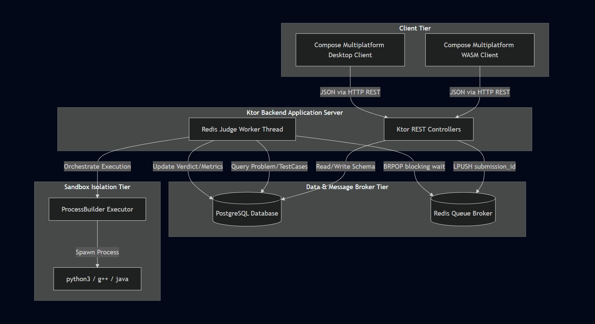

# System Architecture Diagram

This document contains the visual architectural representation of the CodeForge platform.

## Architecture Diagram Overview

## Architectural Components

The diagram above represents the following structural boundaries:

1. **Client Tier:** Compose Multiplatform application compiling to WebAssembly (WASM) for browsers or desktop targets, transmitting REST payloads to the API tier.
2. **API Tier (Ktor Services):** The central server layer built on Ktor and Netty handling incoming connections, persisting job states, fetching external metadata, and orchestrating work queues.
3. **Caching & Asynchronous Transport Tier (Redis):** The distributed non-blocking data structure layer holding the `jobs` list utilized by the backend worker.
4. **Relational Persistence Tier (PostgreSQL):** The database management system structured via the Exposed ORM mapping the `Problems`, `TestCases`, and `Submissions` tables.
5. **Background Compute Tier (Redis Judge Worker):** The internal execution block consuming work via blocking pop (`BRPOP`) commands from Redis.
6. **Isolated Sandbox Tier (Language Executors):** The environment executing solutions via local process boundaries calling language-specific runtimes (`python3`, `g++`, `java`) within the Dockerized application environment.
