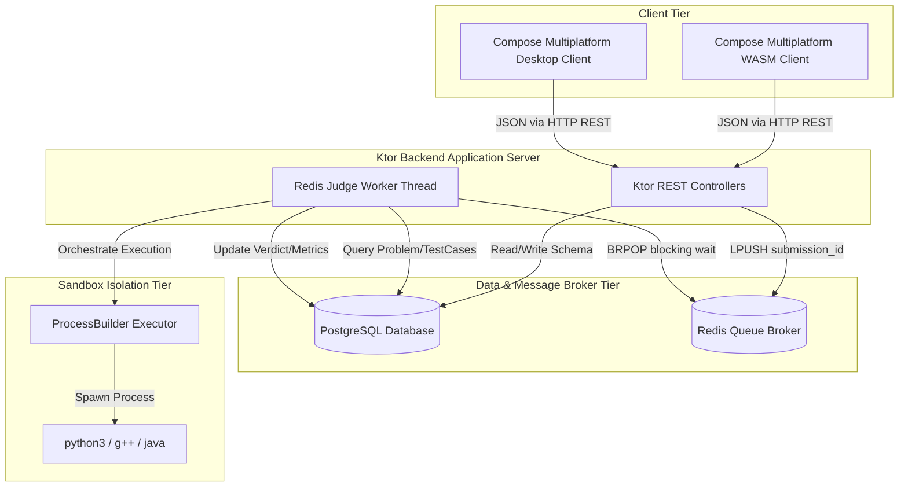

# System Architecture

CodeForge is a full-stack, distributed online judge platform designed to ingest, queue, and evaluate competitive programming solutions. The system decouples the HTTP api ingestion layer from the execution runtime through an asynchronous Redis-backed broker.

---

## High-Level System Architecture

---

## Core Component Responsibilities

### 1. Client Tier (Frontend Application)
* **Implemented:** A unified code base written in Jetpack Compose Multiplatform. The system targets browser environments via Compose for WebAssembly (WASM) and desktop runtimes. It handles live problem viewing, client-side language template provisioning, syntax text rendering, and asynchronous status polling.
* **Future Improvement:** WebSockets-based real-time state push notification channel to replace client-side polling mechanisms.

### 2. Application Server Tier (Ktor Backend)
* **Implemented:** An asynchronous server built on the Ktor framework running over the Netty engine. It exposes REST route segments under distinct controllers (`ProblemRoutes`, `SubmissionRoutes`, `CodeforcesRoutes`).
* **Implemented:** The **Redis Judge Worker** runs concurrently as an internal background processing daemon launched during application server initialization. It executes a blocking event-loop that intercepts execution requests distributed through the data tier.

### 3. Data & Message Broker Tier
* **Implemented:** 
  * **PostgreSQL:** Serves as the primary source of truth, storing structural definitions for problem schemas, validation test matrices, and immutable submission records.
  * **Redis:** Acts as a high-throughput, low-latency messaging interface. It manages a double-ended queue (`jobs` list) to serialize ingestion ordering and ensure zero data loss during high traffic peaks.

### 4. Sandbox Isolation Tier (Language Executors)
* **Implemented:** Execution logic is organized using a factory design pattern (`LanguageExecutorFactory`). Runtimes allocate execution windows through Java's native `ProcessBuilder`. The backend architecture guarantees environment stability by packaging toolchains (`openjdk-21`, `g++`, `python3`) directly into the master application Docker container. Solutions are executed as low-privilege operating system sub-processes using file-system isolation blocks.

---

## Submission Lifecycle & Data Flow

1. **Solution Ingestion:** The client transmits a code payload via `POST /submit`, detailing the structural problem ID, target language, and plain-text code.
2. **State Staging:** The Ktor API persists the submission row to PostgreSQL with a default status state of `QUEUED`.
3. **Broker Distribution:** The server pushes the unique database identifier (`submissionId`) into the Redis `jobs` list using an atomic `LPUSH` call.
4. **Job Consumption:** The background worker intercepts the identifier via a blocking `BRPOP` operation, immediate mutating the state in PostgreSQL to `RUNNING`.
5. **Context Aggregation:** The worker queries PostgreSQL to pull the corresponding problem specifications (runtime thresholds, memory caps) and full evaluation test arrays.
6. **Isolated Sandbox Execution:** The code is written out to distinct UUID-assigned scratchpad files inside a localized sandbox directory. The specific driver (`DockerPythonExecutor`, `DockerCppExecutor`, or `DockerJavaExecutor`) invokes the compiler/interpreter sub-process, passing inputs via standard pipe streams and enforcing time-outs programmatically.
7. **Verdict Resolution:** The output stream is systematically compared against expected hashes. Performance telemetry (runtime latency in milliseconds, estimated system memory usage) is recorded.
8. **Final Persistence:** The worker encodes test matrices to JSON, updates the submission record in PostgreSQL with the final verdict, cleans up filesystem scratchpads, and returns to a blocking wait state.

---

## Component Boundaries & Failure Handling

* **Database Connection Resilience:** Connection pooling is isolated via transaction boundaries. If the database experiences temporary connection drops, the Ktor route throws structured HTTP 500 responses without destabilizing the application loop.
* **Executor Process Bounds:** Sub-processes are programmatically bound by `waitFor` limits. If a submission contains an infinite loop, the runtime forces a process destruction call (`destroyForcibly`), preventing CPU resource leakage and returning a clean `TIME_LIMIT_EXCEEDED` verdict.
* **Worker Isolation:** If a solution crashes the internal execution routines, exceptions are handled within an expansive `try-catch` wrapper inside the worker event loop. The worker sleeps for a defensive cooldown interval before re-establishing its queue listening state, preventing thread deaths.
