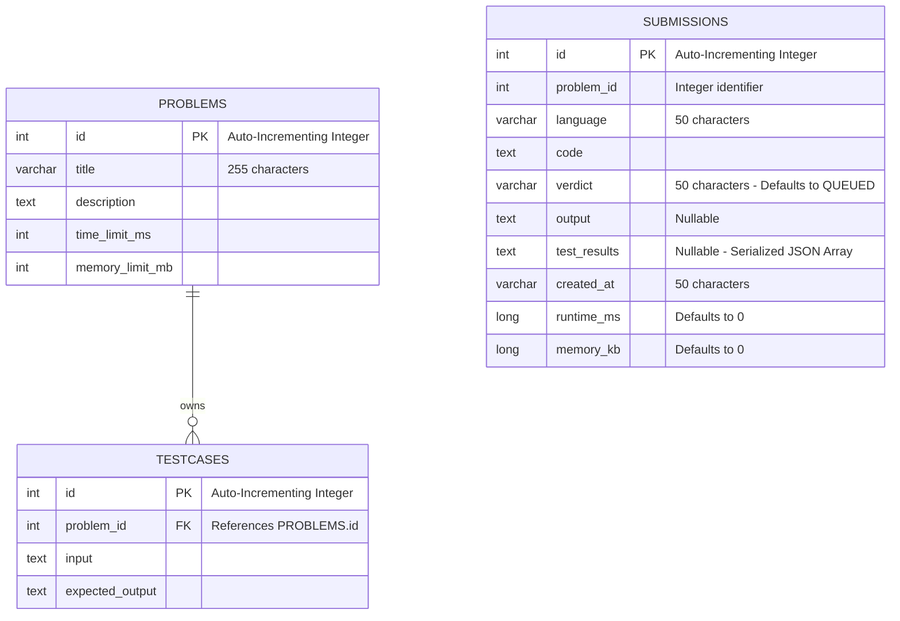

# Database Design

CodeForge utilizes **PostgreSQL** as its core relational storage system. Relational integrity is enforced programmatically and structurally at the database level via the **JetBrains Exposed ORM** framework.

---

## Entity-Relationship Diagram

The schema consists of three core tables mapping out problem ingestion, test suites, and grading historical metrics.

---

## Detailed Data Dictionary

### 1. `Problems` Table
Maps out the system metadata for analytical challenges.

| Column Name | Data Type | Modifiers / Constraints | Description |
|---|---|---|---|
| `id` | `Int` | Primary Key, Auto-Increment | Unique identifier for the challenge. |
| `title` | `Varchar(255)` | Not Null | The user-facing name of the problem. |
| `description` | `Text` | Not Null | Complete problem description text and constraints. |
| `time_limit_ms` | `Int` | Not Null | Maximum allowed execution runtime per test case. |
| `memory_limit_mb`| `Int` | Not Null | Maximum allowed memory consumption. |

### 2. `TestCases` Table
Contains verification pairs used by the background judge worker.

| Column Name | Data Type | Modifiers / Constraints | Description |
|---|---|---|---|
| `id` | `Int` | Primary Key, Auto-Increment | Unique identifier for the test case. |
| `problem_id` | `Int` | Foreign Key (References `Problems.id`) | Relational link indicating problem ownership. |
| `input` | `Text` | Not Null | Raw input data injected into the code's standard input pipe. |
| `expected_output`| `Text` | Not Null | Clean expected standard output token array. |

### 3. `Submissions` Table
Maintains transaction histories for all solutions dispatched to the online judge engine.

| Column Name | Data Type | Modifiers / Constraints | Description |
|---|---|---|---|
| `id` | `Int` | Primary Key, Auto-Increment | Unique tracking identifier. |
| `problem_id` | `Int` | Not Null | Target challenge reference ID. |
| `language` | `Varchar(50)` | Not Null | Target execution environment (e.g., `PYTHON`, `CPP`, `JAVA`). |
| `code` | `Text` | Not Null | Source code text submitted by the client application. |
| `verdict` | `Varchar(50)` | Not Null, Default: `'QUEUED'` | Evaluation status indicator (`QUEUED`, `RUNNING`, `ACCEPTED`, etc.). |
| `output` | `Text` | Nullable | Detailed runtime standard error or system compilation messages. |
| `test_results` | `Text` | Nullable | Serialized JSON collection of granular, per-test evaluation telemetry. |
| `created_at` | `Varchar(50)` | Not Null | ISO string representing submission arrival timestamp. |
| `runtime_ms` | `Long` | Not Null, Default: `0` | Calculated peak execution duration. |
| `memory_kb` | `Long` | Not Null, Default: `0` | Calculated peak execution memory foot-print. |

---

## Architectural Rationale

### Choice of PostgreSQL
1. **Relational Constraints:** Evaluating code solutions requires strict matching boundaries between problems and test data matrices. PostgreSQL handles cascading validations cleanly.
2. **Flexible Telemetry Staging:** The `test_results` field stores structured JSON arrays. PostgreSQL's text optimization permits storing full, high-fidelity execution telemetry blocks without adding complex entity overhead tables.

### Data Flow Characteristics
* **Write Ingestion:** Executed during external API synchronization routines (`/problems/import`) or user code dispatches (`/submit`).
* **Analytical Read Scopes:** Submissions history displays leverage descending sorted indexing paths on `id` fields (`orderBy(Submissions.id, SortOrder.DESC)`) to enable instant tracking pagination.
