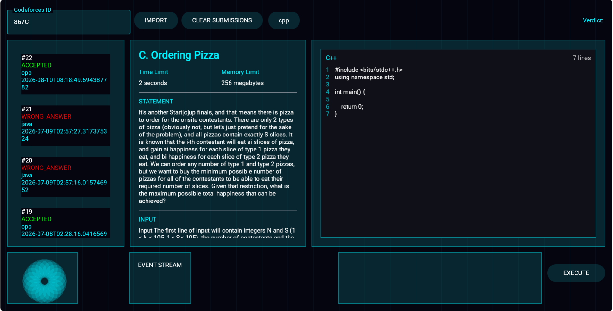
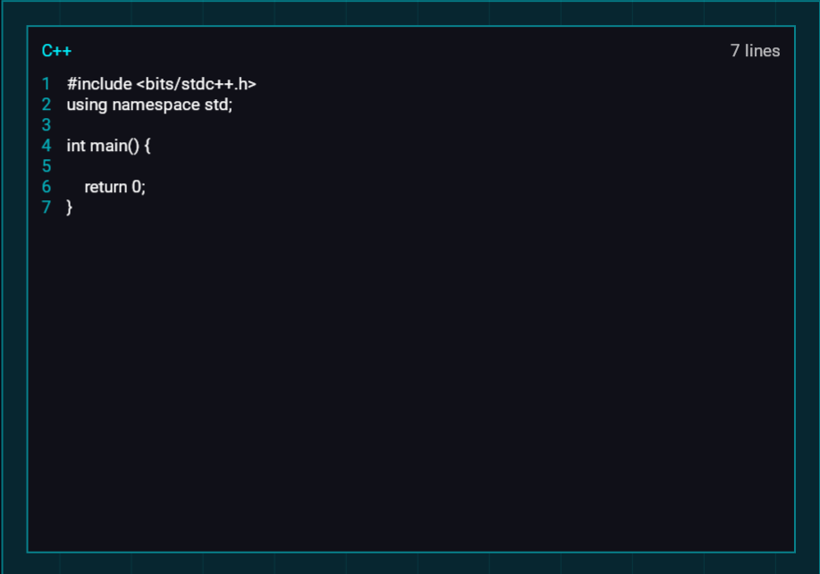
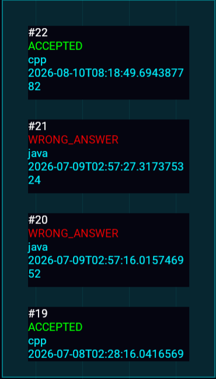
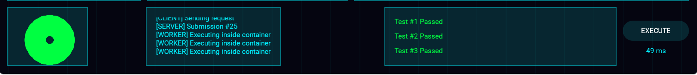
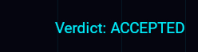

# Screenshot Gallery

This directory contains visual documentation showing the CodeForge application interface and platform architecture.

## UI Component Previews (Placeholders)

Below are the designated positions for platform screenshots. When capturing images, maintain a consistent aspect ratio and professional context.

### 1. Main Dashboard & Problem Repository

* *Description:* Displays the core user interface containing challenge, submissions history, event stream, code editor.

### 2. Multi-Language Code Editor

* *Description:* Illustrates the user workflow inside the browser, highlighting language selection toggles, template pre-population, and solution formatting.

### 3. Asynchronous Submission Status & History

* *Description:* Displays the real-time submission feed, showing standard validation parameters such as unique submission identifiers, target languages, execution timestamps, and platform verdicts.

### 4. Granular Verdict & Evaluation Breakdown

* *Description:* Displays detailed information for a selected submission, listing inputs, expected outputs, received outputs, execution runtime duration (in milliseconds), and peak memory usage metrics.

* *Description:* Final verdict.
---

*Note for Reviewers:* Screen captures are extracted from the Compose Multiplatform WebAssembly (WASM) and desktop client instances running against the containerized Ktor backend application.
